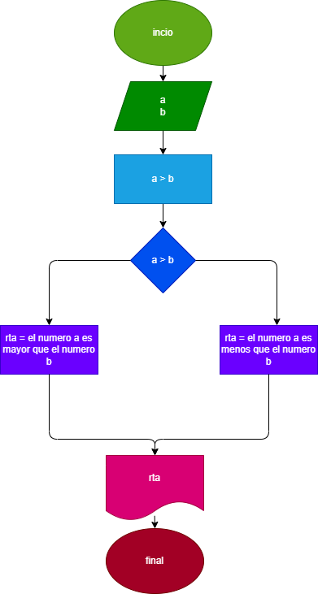
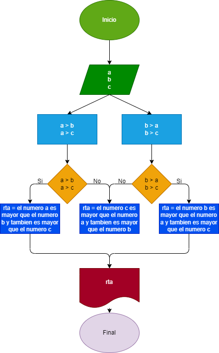
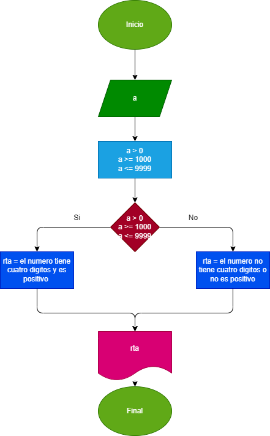

# Trabajo-para-casa
En este trabajo se programarán 3 .py 
# programa 1, para saber cual de dos numeros es mayor
# diagrama de fujo

# programa 2, para saber cual de 3 numero es mayor
 
 

 # programa 3, para saber si un numero es positivo y de cuatro digitos
 
